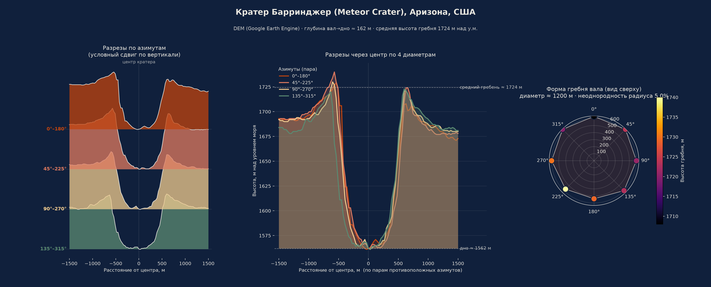

# Мультисенсорный сравнительный анализ земных импактных кратеров

## Цель проекта

Разработать воспроизводимый интерактивный инструмент для сравнительного
дистанционного анализа земных ударных кратеров по морфометрическим,
радиолокационным и оптическим признакам, объединяющий цифровую модель
рельефа (DEM), Sentinel-1 (радар) и Sentinel-2 (оптика/SWIR) в единой
среде Google Earth Engine.

## Научная постановка

Земной реестр импактных структур неполон: многие кратеры разрушены
эрозией и тектоникой, перекрыты осадками, растительностью или водой.
Выявление и морфометрическое описание сохранившихся структур по данным
ДЗЗ имеет научное и прикладное значение, но **дистанционные признаки
сами по себе не подтверждают импактное происхождение** (см. раздел
«Ограничения» ниже). Проект решает более узкую и честную задачу:
дать воспроизводимый способ **измерить и сравнить** морфологию,
радарный отклик и спектральные характеристики нескольких кратеров
между собой и с опубликованными геологическими данными.

## Ключевые объекты

- **Barringer / Meteor Crater** (Аризона, США) — осадочные породы, ~50 тыс. лет, эталонный/наиболее изученный объект.
- **Lonar** (Индия) — базальт (Деканские траппы), возраст датирован противоречиво (~570 или ~37.5 тыс. лет по разным методам), кратер частично занят озером.
- **Wolfe Creek** (Австралия) — песчаник, ~120 тыс. лет, кратер значительно занесён эоловым песком.

Три разных типа мишени и три разных стадии сохранности — намеренный
выбор, чтобы проверить, работает ли один и тот же воспроизводимый
скрипт без переписывания кода под каждый объект.

## Источники данных

| Тип | Источник | Разрешение | Роль |
|---|---|---|---|
| DEM (лидар) | USGS 3DEP 1m | 1 м | максимальная детальность, только США |
| DEM (радар) | Copernicus GLO-30 | ~30 м | глобальный, единый источник для сравнения |
| DEM (запасной) | SRTM GL1 | ~30 м | подстраховка при отсутствии первых двух |
| Оптика | Sentinel-2 SR Harmonized | 10-20 м | RGB, NIR, SWIR (B11/B12), индексы NDVI/NDMI |
| Радар | Sentinel-1 GRD (IW, VV+VH) | 10 м | обратное рассеяние, текстура поверхности |

## Обработка DEM

Приложение поддерживает **два режима** (переключатель `demMode` в панели):

- **«Единый DEM для сравнения»** — один и тот же глобальный источник
  (Copernicus GLO-30, с SRTM как запасным вариантом) для всех кратеров.
  Рекомендуется, когда сравниваются несколько объектов: разница в
  разрешении между лидаром (1 м) и GLO-30 (~30 м) сама по себе создаёт
  видимую разницу в резкости профиля, не связанную с реальной геологией.
- **«Максимальное доступное разрешение»** — лидар (США) → GLO-30 →
  SRTM по приоритету. Даёт более детальный профиль там, где лидар
  доступен, но делает кратеры несопоставимыми по разрешению между собой.

Фактически использованный источник всегда явно указывается в панели
статуса и в экспортируемых метаданных — приложение не смешивает
источники разного качества молча.

## Радиальные профили

Вокруг центра кратера строится N лучей (по умолчанию 8) с равномерным
шагом по азимуту (0° = север, по часовой стрелке); вдоль каждого луча
через `stepM` метров сэмплируются DEM, уклон, отмывка рельефа и
Sentinel-1 (VV/VH/разность). Точки считаются плоским приближением с
поправкой на широту (cos(lat)) — попытка заменить это точной
геодезической проекцией (AEQD) не удалась на практике (Earth Engine не
принял proj4-синтаксис), поэтому оставлен прежний, реально проверенный
способ. На профилях длиной ~1.5 км в умеренных широтах ошибка
аппроксимации пренебрежимо мала; для больших радиусов или приполярных
кратеров её стоит перепроверить (см. комментарий в коде).

- **Дно кратера** — медиана высот в центральной зоне (по умолчанию
  первые 10% длины профиля), а не высота в одной точке — устойчивее к
  локальному шуму DEM. Дополнительно считается стандартное отклонение.
- **Гребень вала** — максимум высоты в настраиваемой полосе (по
  умолчанию 20-60% длины профиля) отдельно по каждому азимуту; затем
  среднее, медиана, стандартное отклонение и разброс по всем азимутам.
  Приложение автоматически проверяет чувствительность результата к
  границам этой полосы и предупреждает, если результат нестабилен.
- **`rim_radius_cv_percent`** (бывший «индекс округлости») — это
  коэффициент вариации радиуса вала (`std/mean * 100`), то есть
  относительная неоднородность радиуса вала по азимутам. Это НЕ
  геометрическая circularity (которая считается по площади и периметру
  контура) — переименовано, чтобы не вводить в заблуждение.
- **Нормированный профиль** — `r_norm = distance / mean_rim_radius`,
  `h_norm = (DEM − floor) / (rim − floor)`. Позволяет сравнивать форму
  кратеров разного размера на одном графике (см.
  `normalized_profile_compare.py`).

## Зональная статистика

Вокруг центра строятся 4 кольцевые зоны (границы задаются как доли
среднего радиуса вала, настраиваются в панели):

1. **дно/центральная зона**;
2. **внутренний склон + вал**;
3. **внешняя зона выбросов**;
4. **окружающая равнина** (остаток AOI).

Для каждой зоны по DEM, Sentinel-1 (VV, VH, VV−VH) и Sentinel-2 (B4,
B8, B11, B12, NDVI, NDMI) считаются count, mean, median, stdDev, min,
max, p25, p75. Зоны заданы относительными долями радиуса вала, поэтому
сопоставимы между кратерами разного размера; при экспорте это явно
указано в метаданных.

## Sentinel-1 (радар)

VV, VH и их разность (VV−VH). Можно выбрать направление орбиты
(`ASCENDING` / `DESCENDING` / `BOTH`) — смешивание сцен с разным
направлением орбиты меняет геометрию наблюдения и потенциально
затрудняет интерпретацию, поэтому режим `BOTH` явно отражается в
статусе и в имени экспортируемого файла, а не используется молча.
Приложение показывает число использованных сцен.

**Важно:** радар показывает пространственные различия обратного
рассеяния и текстуры поверхности, интерпретируемые с учётом
шероховатости, влажности, геометрии наблюдения и морфологии рельефа —
это не прямой индикатор ударного происхождения. Наблюдение «вал ярче
дна» по трём изученным объектам — эмпирический результат по конкретной
выборке, а не общий закон.

## Sentinel-2 (оптика + SWIR)

Полосы B2, B3, B4, B8, B11, B12; слои RGB, false-color NIR, SWIR-композит
(B12/B8/B4), NDVI, NDMI, отношение B11/B12. Облака/тени маскируются по
Scene Classification Layer (SCL). SWIR-каналы показывают спектральные
различия состава и влажности поверхности — они не доказывают ударное
происхождение автоматически и требуют геологической интерпретации.

## Ограничения метода

- **Не доказывает импактное происхождение.** Согласно принятой в
  литературе методике (Koeberl, 2004), однозначное подтверждение
  возможно только по петрографическим/геохимическим признакам ударного
  метаморфизма (планарные деформационные структуры в кварце, конусы
  разрушения, высокобарные полиморфы кремнезёма, геохимические
  аномалии PGE) — то есть по образцам породы, а не по спутниковым данным.
- **Не заменяет полевые и лабораторные исследования.** Выполняет
  дистанционное сопоставление признаков и может использоваться как
  инструмент отбора кандидатов для дальнейшей проверки, но не как её
  замена.
- **Зависит от качества DEM.** Разрешение 30 м не резолвит кратеры
  диаметром существенно меньше нескольких сотен метров; смешение DEM
  разного разрешения при сравнении нескольких кратеров искажает
  морфометрию (см. «Обработка DEM» выше).
- **Зависит от геометрии съёмки.** Направление орбиты Sentinel-1, угол
  падения и сезон съёмки Sentinel-2 влияют на итоговые значения
  обратного рассеяния и спектральных индексов.
- **Каталожные координаты ориентировочные** — предусмотрена ручная
  правка кликом по центру на снимке.
- **Часть кода выполняется синхронно** (`.getInfo()`), поэтому
  обновление может занимать несколько секунд — сознательный компромисс
  ради простоты кода.
- **У Earth Engine Map нет встроенного виджета масштабной линейки/
  стрелки на север** — это ограничение платформы; вместо этого масштаб
  и ориентация (0° = север, по часовой стрелке) указаны текстом в
  панели статуса и в метаданных.

## Научная новизна

Научная новизна проекта состоит в разработке воспроизводимого
интерактивного workflow для сравнительного мультисенсорного анализа
земных импактных кратеров, объединяющего оптические и радиолокационные
данные, цифровые модели рельефа, радиальные профили и зональную
статистику в единой среде Google Earth Engine.

Проект **не заявляет**:
- разработку нового алгоритма автоматического распознавания кратеров;
- доказательство импактного происхождения по одному спутниковому признаку;
- полноценную геологическую верификацию без независимых геологических данных.

## Установка (Python-часть)

```bash
pip install numpy matplotlib pandas python-pptx pillow
```

## Запуск

1. **GEE-приложение** (`gee_crater_app.js`): открыть
   [code.earthengine.google.com](https://code.earthengine.google.com/),
   вставить скрипт целиком, Run. Выбрать кратер или ввести координаты,
   при необходимости открыть секции DEM/Sentinel-1/зоны, нажать
   «Обновить карту».
2. Скачанные CSV положить в эту папку.
3. Запустить нужный Python-скрипт (см. ниже).

## Экспорт из GEE-приложения

| Кнопка | Файл | Содержимое |
|---|---|---|
| Профиль (сырой) | `<Кратер>_profile_raw_<DEM>_<годы>.csv` | точки профиля + метаданные |
| Профиль (нормированный) | `<Кратер>_profile_normalized_<годы>.csv` | r_norm, h_norm |
| Зональная статистика | `<Кратер>_zonal_stats_S1_S2_DEM_<годы>.csv` | статистика по 4 зонам |
| Метаданные анализа | `<Кратер>_metadata_<годы>.csv` | все параметры запуска |
| Снимки | `<Кратер>_<продукт>_<годы>.tif` × 7 | S2 RGB/SWIR/NDVI, DEM, hillshade, slope, S1 |

Пример имени: `Barringer_DEM_Copernicus_2023_2025.tif`.

## Python-скрипты

| Скрипт | Результат |
|---|---|
| [`plot.py`](plot.py) | главный график: разрезы по азимутам + явная шкала высот + полярная форма вала (один кратер) |
| [`case_study_chart.py`](case_study_chart.py) | компактная версия для каждого из трёх кратеров |
| [`compare_craters.py`](compare_craters.py) | наши измерения vs публикации vs эталонная кривая depth/diameter |
| [`radar_backscatter_chart.py`](radar_backscatter_chart.py) | радарный отклик вала vs дна |
| [`normalized_profile_compare.py`](normalized_profile_compare.py) | сравнение нормированной формы трёх кратеров |
| [`build_presentation.py`](build_presentation.py) | сборка `crater_presentation.pptx` |

## Главный результат (ДЗ, Задание №1)



## Результаты (сводка)

| Кратер | Диаметр (наше / публ.) | Глубина (наше / публ.) |
|---|---|---|
| Барринджер | 1200 м / 1200 м | 162 м / 170 м |
| Lonar | 1890 м / 1830 м | 111 м / ~137 м |
| Wolfe Creek | 930 м / 892 м | 46 м / 178 м* |

\* исходная глубина по публикации, до заполнения кратера песком.
